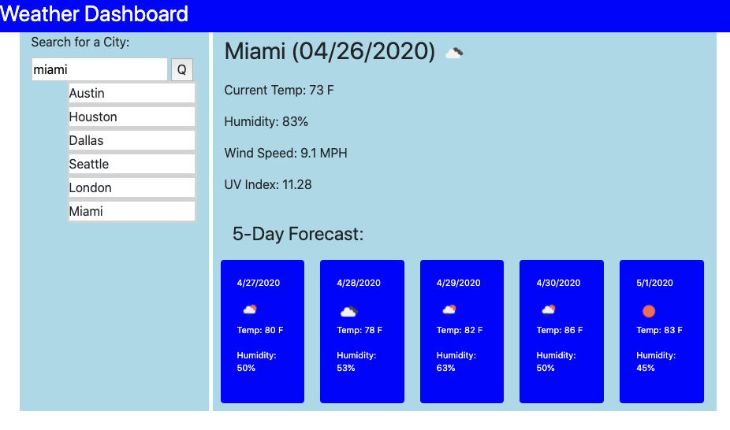

# weather-dashboard

## Russell Morgan

This week's challenge was to create a weather display for any sity entered. Cities are saved to local storage in order to keep a list of previous cities tried. Invalid city entries are not saved in storage.

Initially used the weather and forecast apis, but switched over to the oneCall api. Works great but do need the cities lattitude and longitude coordinates.

A couple of enhancements that require future code changes are; show the description when hovering over the weather icon, show min and max for each day, display direction the wind is coming from based on the degrees number(0-360) and include feels like conditions.

Enjoyed this challenge the best so far. My only regret was not switching to the oneCall api sooner.

Code Link:  https://github.com/rhmorganjr/weather-dashboard

Code Page:  https://rhmorganjr.github.io/weather-dashboard/

